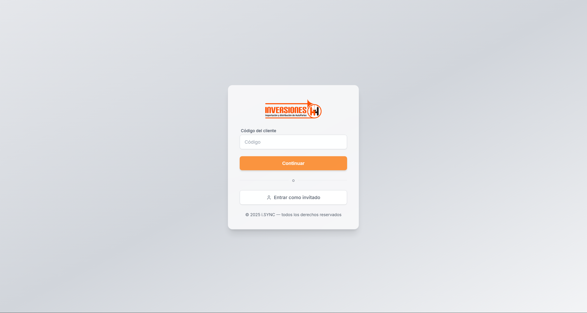
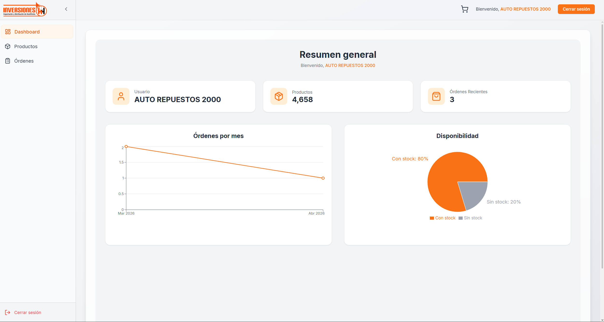
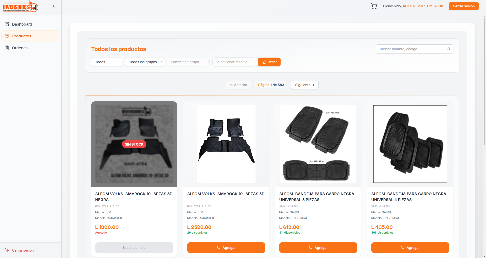
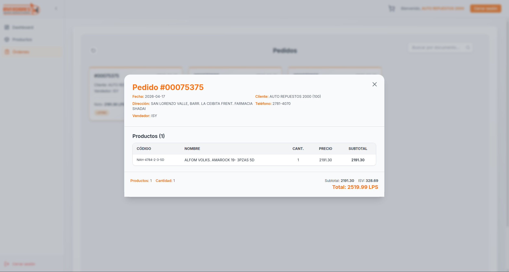

# ERPBridge


A full-stack B2B ordering platform built for a Latin American distribution company. Clients browse a live product catalog, manage a cart, and submit orders that are inserted directly into the company's ERP system.

## Screenshots

| Login | Dashboard |
|---|---|
|  |  |

| Product catalog | Order detail |
|---|---|
|  |  |

## What it does

- Clients authenticate with a client code + password (first-login flow creates the account)
- Product catalog with live stock from the ERP, search, and category/model filters
- Cart persists on the server with version-based sync — client only re-fetches when the version changes
- Orders are inserted into ERP transaction tables in a single locked transaction, then emailed as PDFs
- Failed orders are stored in Redis and retried automatically on the next scheduler tick
- Admin receives email alerts when orders fail or the ERP is unreachable
- Unauthenticated visitors can browse the catalog (cart saved in localStorage, synced on login)

## Stack

| Layer | Technology |
|---|---|
| Backend | NestJS 11, TypeORM, MySQL 8 |
| Cache / queue | Redis |
| Auth | JWT, bcrypt |
| Email / PDF | Nodemailer, html-pdf-node |
| Frontend | React 19, TypeScript, Vite |
| Styling | Tailwind CSS, Headless UI |
| State | Context API + custom hooks |

## Getting started

### Requirements

- Node.js 20+
- MySQL 8
- Redis

### Backend

```bash
cd erpbridge-backend
cp .env.example .env   # fill in your values
npm install
npm run start:dev
```

Swagger docs available at `http://localhost:3001/docs` in development mode.

### Frontend

```bash
cd erpbridge-frontend
npm install
npm run dev
```

App runs at `http://localhost:5173`.

### Tests

```bash
cd erpbridge-backend
npm run test
```

## Project layout

```
erpbridge-backend/src/
  modules/
    auth/        # JWT login, first-login setup, password reset via email
    articulos/   # Product catalog with ERP pricing and live stock
    carrito/     # Cart persistence and version-based sync
    pedidos/     # Order creation, batch inserts, PDF generation, email
    cliente/     # Client data from ERP
    empresa/     # Company config
    agencias/    # Agency config
    images/      # Serve product images from ERP filesystem paths
  database/      # Boot-time schema verification (ensures required columns exist)
  templates/     # HTML templates for order PDFs and confirmation emails

erpbridge-frontend/src/
  context/       # Auth, Products, Cart, Orders global state
  pages/         # Route-level components (Dashboard, Orders, Login, etc.)
  components/    # UI components (ProductGrid, CartDrawer, OrderDetailModal, etc.)
  services/      # API client layer
  hooks/         # Custom hooks
```

## Notable design decisions

**Version-based cart sync** — instead of polling the full cart on every interaction, the client polls a single integer (a Unix timestamp). It only fetches the full cart when the version changes. This keeps DB load low with many concurrent users.

**Batch order inserts** — line items are processed in memory first, then inserted in chunks of 50 with a single `INSERT ... VALUES (...)` per chunk. The header and lines are wrapped in a transaction with `LOCK TABLES` on both tables to get a consistent document number without races.

**Fire-and-forget emails** — the email+PDF step starts after the HTTP response is already sent. If it fails, the admin gets an alert email with the error details, but the client already has their confirmation. The raw order data is also stored in Redis so it can be retried if the ERP was unreachable.

## Environment variables

See [erpbridge-backend/.env.example](erpbridge-backend/.env.example) for the full list with descriptions.
