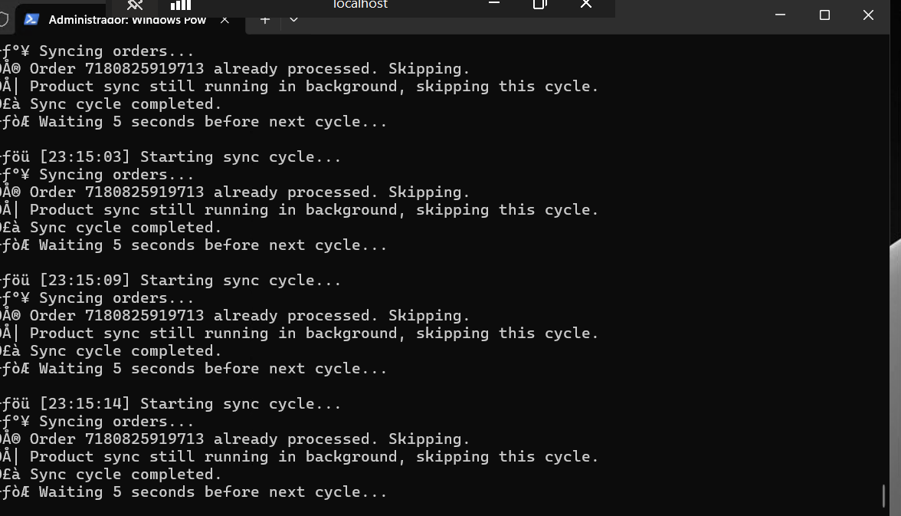
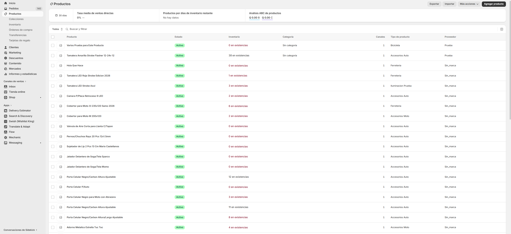
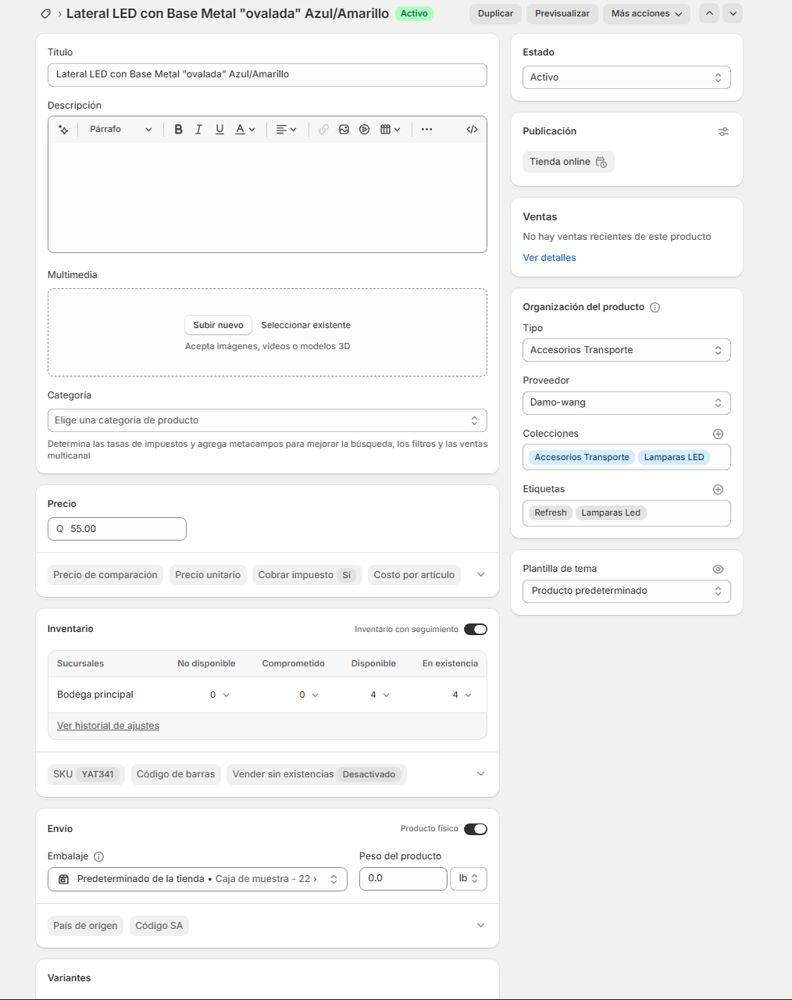
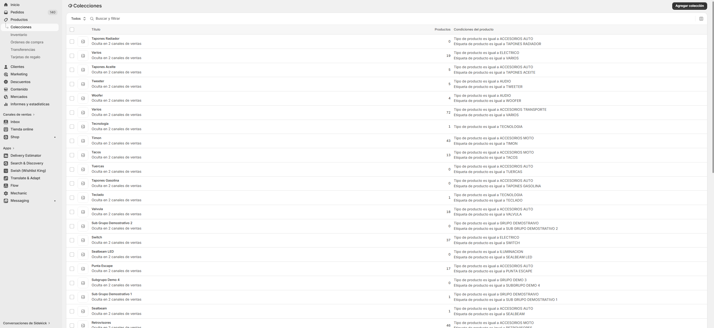
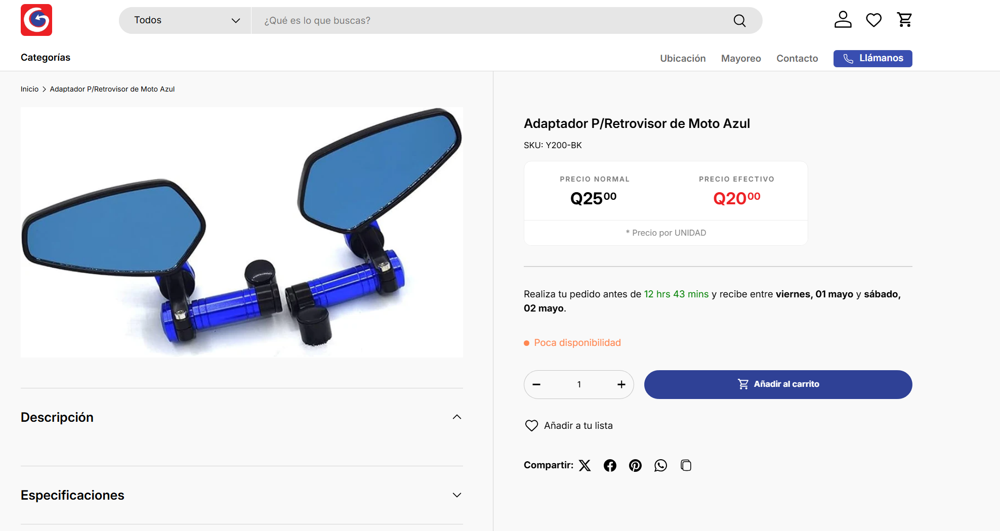
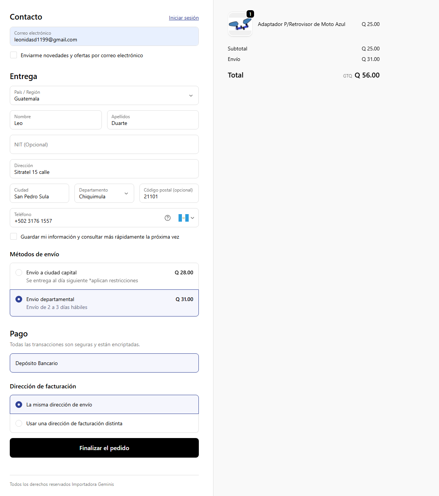

# SpySync — Shopify ↔ ERP Sync Service


A .NET 8 Windows Worker Service that keeps a Shopify storefront in real-time sync with a legacy Latin American ERP system. It runs as a background Windows Service and handles product publishing, inventory deltas, order ingestion, and collection management automatically.

---

## Screenshots

| Sync cycle running in console | Products published to Shopify |
|---|---|
|  |  |

| Product detail synced from ERP | Smart Collections auto-created from ERP groups |
|---|---|
|  |  |

| Store overview | Order payment summary |
|---|---|
|  |  |

---

## What it does

- **ERP → Shopify products** — pushes product name, price, vendor, tags, and inventory on a 30-second interval; only sends updates when ERP data actually changed
- **Shopify → ERP orders** — polls new Shopify orders and inserts them as sales documents (`operti` header + `opermv` line items) with inventory deduction and tax calculation
- **Smart Collections** — reads ERP product groups and subgroups and auto-creates matching Shopify collections with tag/type rules
- **ERP order mirroring** — manually created ERP orders are reflected back to Shopify (tagged `ERP-MANUAL`) so committed inventory stays accurate on both sides
- **Startup schema bootstrap** — creates required tables, columns, stored procedures, and functions on first run; safe to re-run

---

## Tech stack

| Layer | Technology |
|---|---|
| Runtime | .NET 8 Worker Service (Windows Service) |
| Database | MySQL via `MySql.Data` |
| HTTP | `HttpClient` + Shopify Admin REST API |
| Serialization | Newtonsoft.Json with typed DTOs |
| Config | `IOptions<T>` bound from `appsettings.json` |
| Logging | `ILogger<T>` structured logging |

---

## Architecture

SQL is separated from orchestration using a repository pattern:

```
Worker.cs                  — main loop, Shopify HTTP calls, cycle scheduling
DbBootstrapService.cs      — schema migrations on startup (tables, columns, SPs)
ProductCacheRepository.cs  — local shopify_products cache + order sync bookmark
ErpOrderRepository.cs      — order creation, inventory queries, decimal rounding config
ErpCatalogRepository.cs    — active products, SKU set, groups, unlinked orders
ShopifyModels.cs           — typed Shopify API response DTOs
ShopifySettings.cs         — strongly-typed configuration model (IOptions)
```

---

## Configuration

Fill in `appsettings.json` with your values:

```json
{
  "ShopifySettings": {
    "ConnectionString": "Server=YOUR_HOST;Port=3306;Database=YOUR_DB;Uid=YOUR_USER;Pwd=YOUR_PASSWORD;SslMode=None;",
    "AccessToken": "shpat_YOUR_SHOPIFY_ACCESS_TOKEN",
    "StoreUrl": "your-store.myshopify.com",
    "ApiVersion": "2024-10",
    "LocationId": "YOUR_SHOPIFY_LOCATION_ID",
    "Almacen": "01",
    "Empresa": "001000",
    "Agencia": "001",
    "DbName": "YOUR_DB_NAME",
    "AlertEmails": "your@email.com",
    "SmtpUser": "your@gmail.com",
    "SmtpPass": "your-gmail-app-password",
    "DefaultClientCode": "CLI001",
    "DefaultVendedor": "VEND01",
    "DefaultTipoPrecio": 1,
    "DefaultEstacion": "WEB",
    "DefaultUemisor": "WORKER"
  }
}
```

| Key | Description |
|---|---|
| `Almacen` | Warehouse code in the ERP — inventory is read from and written to this warehouse |
| `Empresa` | Company ID — the ERP supports multiple companies under one database |
| `Agencia` | Branch/agency code — transactions are scoped to a specific branch |
| `DefaultClientCode` | ERP client assigned to incoming Shopify orders (typically a generic "web store" client) |
| `DefaultVendedor` | Salesperson code assigned to orders created from Shopify |
| `DefaultTipoPrecio` | Price list number — the ERP stores multiple price tiers (1 = retail, 2 = wholesale, etc.) |
| `DefaultEstacion` | Workstation identifier — the ERP logs which terminal originated each transaction |
| `DefaultUemisor` | Issuer code — identifies this service as the creator of ERP documents |

---

## Build & run

```bash
dotnet restore
dotnet build -c Release
dotnet publish -c Release -o ./publish

# Run as a console app for testing
cd publish
dotnet WorkerService1.dll
```

---

## Install as a Windows Service

From an **elevated** terminal:

```powershell
sc.exe create SpySync binPath="C:\path\to\publish\WorkerService1.exe" start=auto
sc.exe description SpySync "Shopify-ERP real-time sync"
sc.exe start SpySync
```

```powershell
# Uninstall
sc.exe stop SpySync
sc.exe delete SpySync
```

---

## Requirements

- Windows Server 2019+ or Windows 10/11
- [.NET 8 Runtime](https://dotnet.microsoft.com/download/dotnet/8.0)
- MySQL 5.7+ / MariaDB 10.3+
- Shopify Admin API token with `read_products`, `write_products`, `read_orders`, `write_orders`, `read_inventory`, `write_inventory` scopes
