# ShipSync


A logistics management platform for freight forwarding companies. Operators manage clients, quotations, shipments, and pricing; B2B clients get scoped access to their own records; agents interact through a passwordless portal.

## Screenshots

| Login | Dashboard |
|---|---|
| 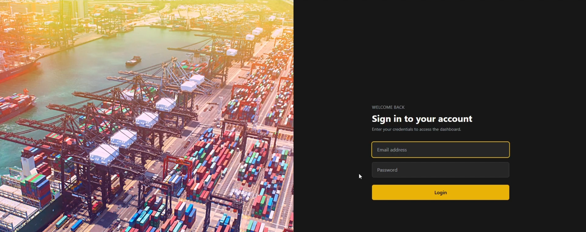 | 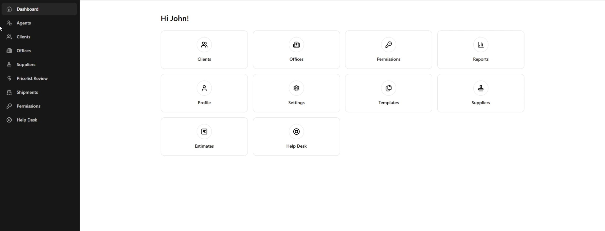 |

| Client creation | Agents |
|---|---|
| 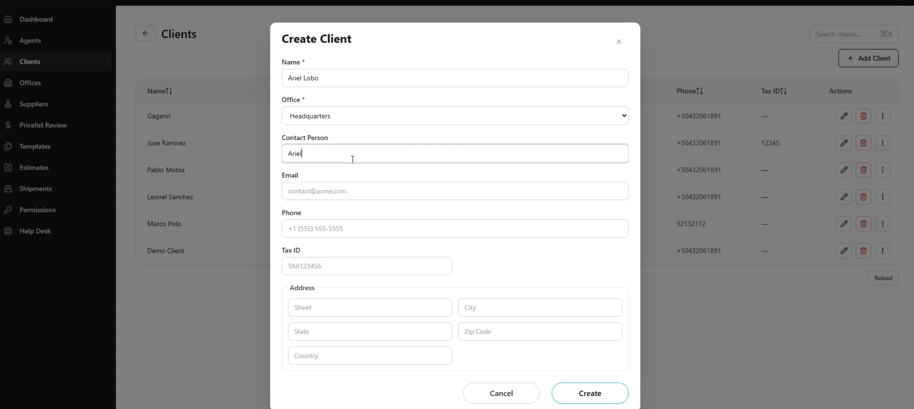 | 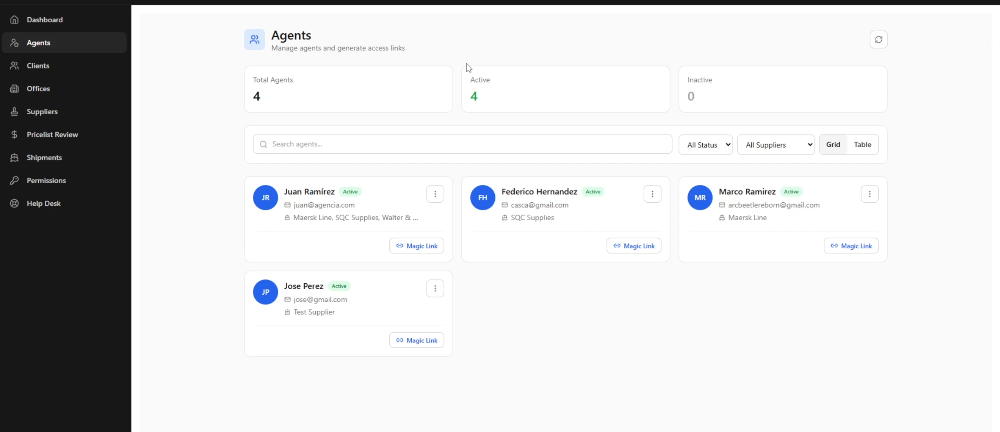 |

| Agent portal | Quote builder |
|---|---|
| 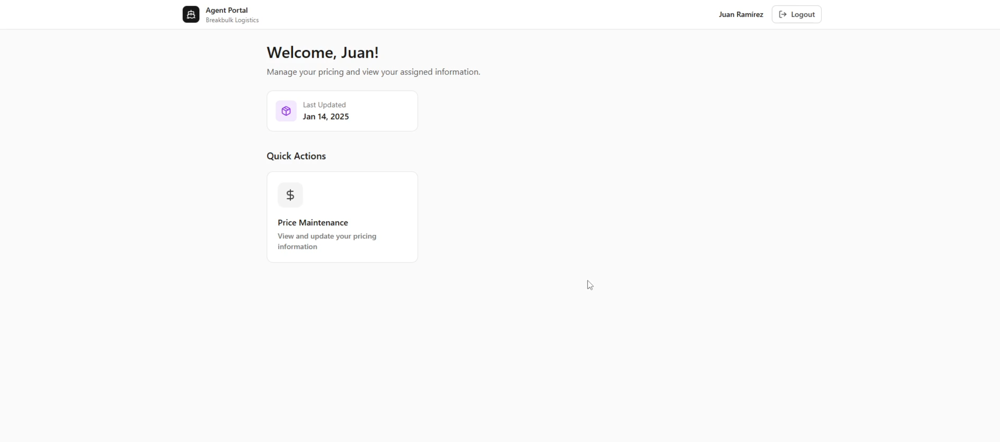 | 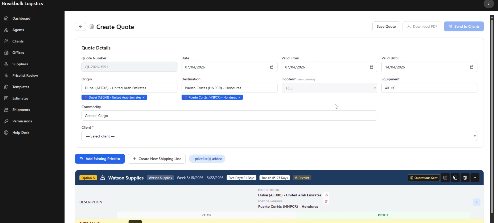 |

| Quote PDF | Pricelist creation |
|---|---|
| 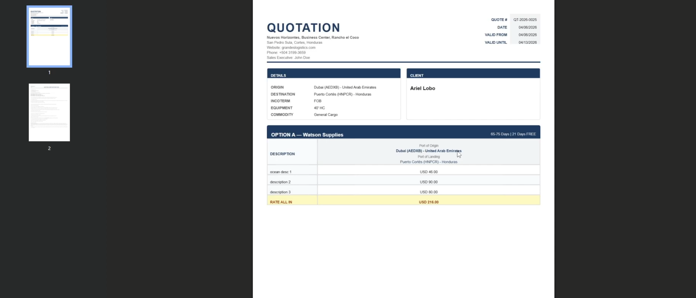 | 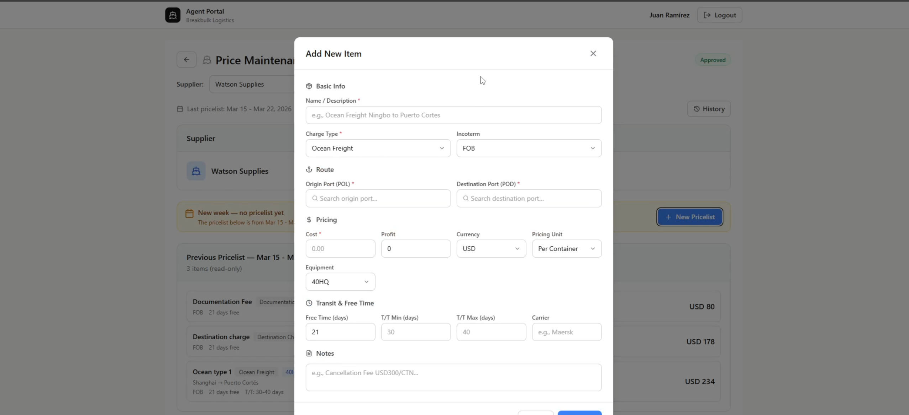 |

| Pricelist review | Shipment creation |
|---|---|
| 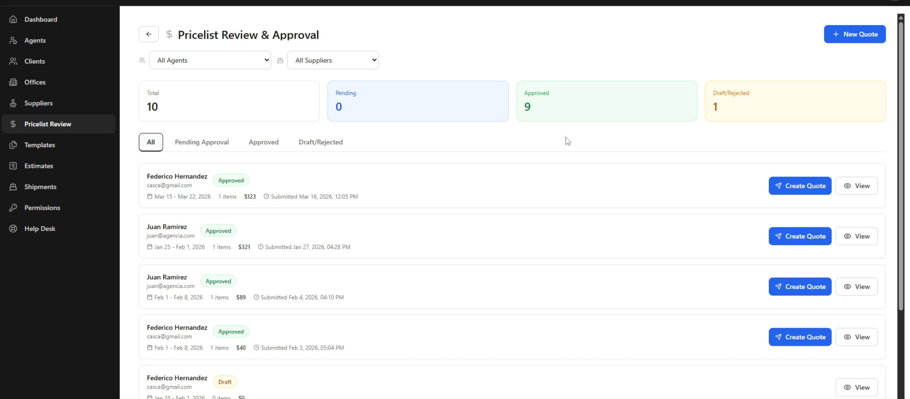 | 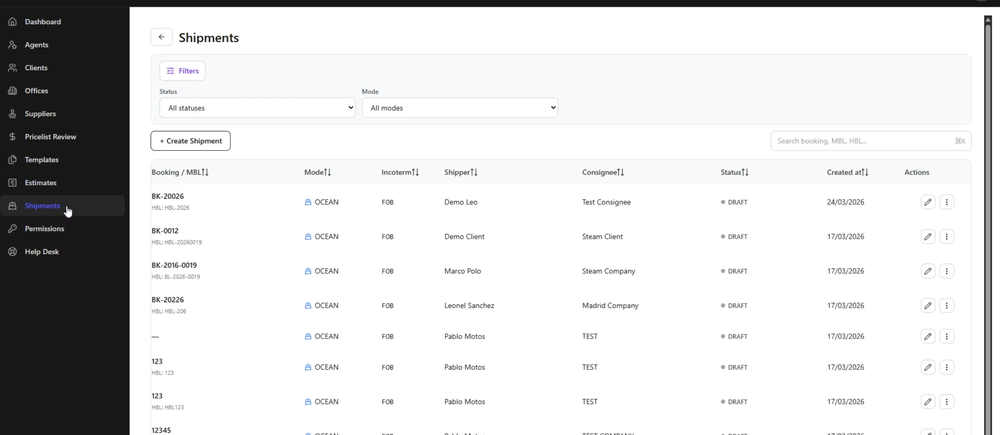 |

| Legal documents (PDF) | Financial ledger |
|---|---|
| 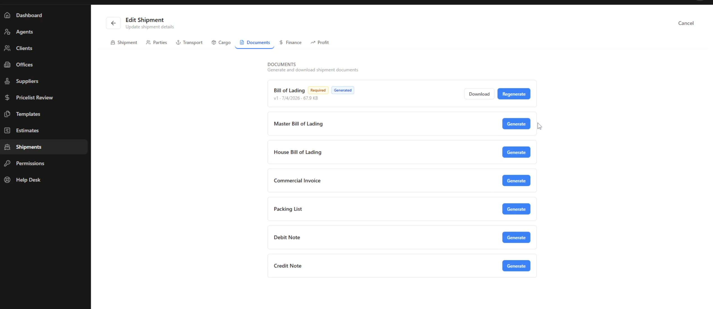 | 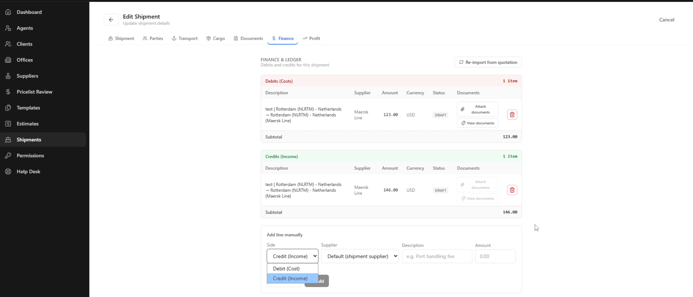 |

| Client portal | Client records |
|---|---|
| 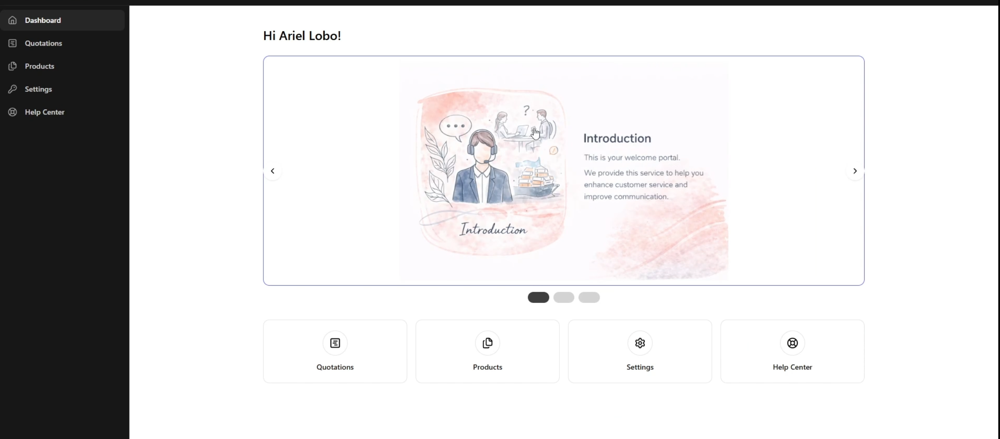 | 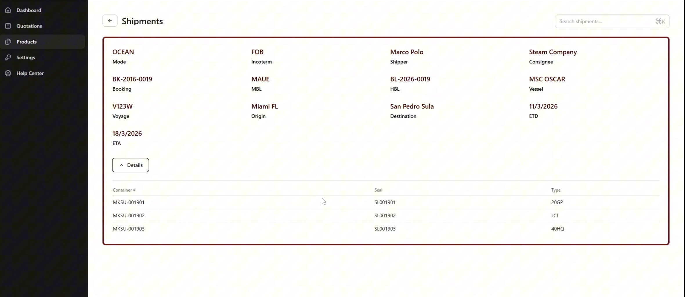 |

| Email notification | Password change |
|---|---|
| 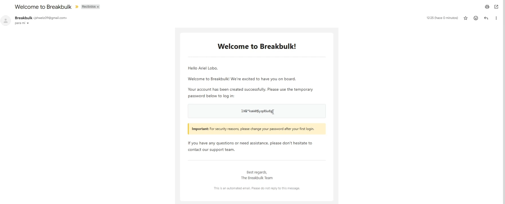 | 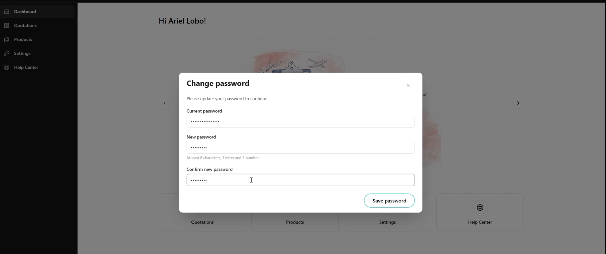 |

## What it does

- **Multi-tenant RBAC** — permissions stored per user, enforced via `PermissionGuard` and `@RequirePermissionDecorator`. Three role codes: `ops_admin`, `admin`, `client`
- **Quotation lifecycle** — draft → sent → accepted/rejected/expired. Template-based or free-form line items. PDF generated on demand; email sent to client on status transition to `sent`
- **Pricelist distribution** — operators upload a PDF pricelist and send it to any subset of clients; delivery snapshots are deduplicated using a field-normalized deep comparison so the same content is never re-sent
- **Shipment management** — full shipment lifecycle with document generation (MBL, HBL, AWB, Carta Porte, commercial invoice) via a Handlebars template engine. Quotation line items can be imported directly into the shipment ledger
- **Agent magic-link login** — agents authenticate via a one-time token link; no password required. JWT is issued on validation
- **Financial ledger** — debit/credit lines per shipment, sourced from quotation items or entered manually. Full approval flow (draft → submitted → approved/rejected)
- **Audit history** — every significant mutation is recorded with before/after diff and actor info
- **70 MongoDB migrations** — schema setup, seeding, and permission assignments are fully scripted with migrate-mongo

## Stack

| Layer | Technology |
|---|---|
| Backend | NestJS 11, Mongoose, MongoDB |
| Auth | Passport JWT, bcrypt, magic-link tokens |
| Documents | PDFKit, Handlebars templates |
| Email | Nodemailer |
| Frontend | React 19, TypeScript, Vite, PrimeReact, Zustand |
| Infra | Docker, Nginx (production) |

## Getting started

### Requirements

- Node.js 20+
- Docker (for MongoDB)

### Backend

```bash
docker-compose up -d          # start MongoDB
cd apps/api
cp ../../.env.example .env    # fill in your values
npm install
npm run mm:up                 # run migrations
npm run start:dev
```

API and Swagger docs at `http://localhost:3000/api`.

### Frontend

```bash
cd apps/frontend
npm install
npm run dev
```

App runs at `http://localhost:5173`.

### Tests

```bash
cd apps/api
npm run test          # unit tests
npm run test:e2e      # e2e (requires running MongoDB)
```

## Project layout

```
apps/
  api/src/
    auth/           # JWT login, magic-link agent auth, permission guard
    clients/        # B2B client records with client-role data isolation
    quotations/     # Quote creation, PDF, email, delivery deduplication
    shipments/      # Shipment lifecycle, ledger lines, document engine
    pricing/        # Agent pricelists, distribution, pricelist-to-client send
    templates/      # Reusable quotation templates per company
    agents/         # Agent management and magic-link service
    shippings/      # Shipping line (carrier) management
    ports/          # Port directory (UN/LOCODE)
    history/        # Audit log
    mail/           # Email service and Handlebars templates
    schemas/        # All Mongoose schemas
    mongo/          # migrate-mongo migration files
  frontend/src/
    screens/        # Route-level components
    components/     # Shared UI
    services/       # API client layer
    stores/         # Zustand global state
```

## Notable design decisions

**Delivery deduplication** — before persisting a `QuotationDelivery` record, the incoming snapshot is normalized (volatile fields like `status`, `updatedAt`, `__v` are stripped) and deep-compared against the latest stored delivery for that client. If the content is identical, the write is skipped. This prevents duplicate delivery entries when an operator re-sends without changes.

**Client-role data isolation** — users with `roleCode: "client"` have an optional `user.client` ObjectId. Services check this at query time and restrict list/read to that single client record. No middleware layer needed.

**Document template engine** — shipment documents (MBL, HBL, AWB, etc.) are generated from Handlebars HTML templates stored in MongoDB, rendered server-side to PDF. Templates are versioned and can be updated without a deploy.

**Magic-link agent auth** — agents have no passwords. A hashed one-time token is stored with an expiry; the agent clicks a link, the API validates the token, and returns a standard JWT. Use count and last-used timestamp are tracked per token.

**Ledger sourcing** — financial lines on a shipment can be seeded directly from the quotation's accepted line items, preserving price and description. Each line then goes through its own approval flow independently.

## Environment variables

See [.env.example](.env.example) for the full list with descriptions.
